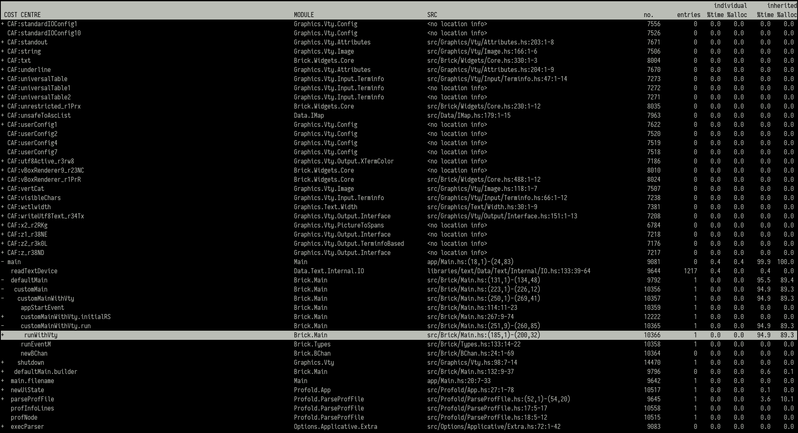

# profold

This project is a terminal-based viewer for ghc `.prof` files. These files are
the result of profiling with `+RTS -p`, and can easily be thousands of lines
long. This makes it cumbersome to browse through them and find the interesting
bits.

Since `.prof` files have a tree-like structure, an obvious improvement for
viewing them is folding and unfolding parts of the tree, which is what profold
allows you to do.



## Usage

Open a file with profold:
```
$ profold file_to_open.prof
```

Arrow keys or vim-like keybindings to navigate. Tab to fold or unfold the
current item.
